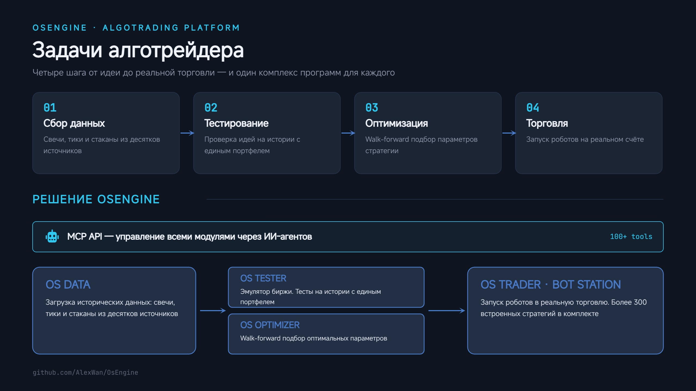
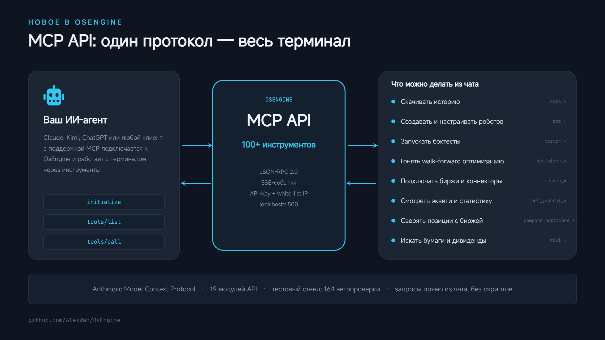
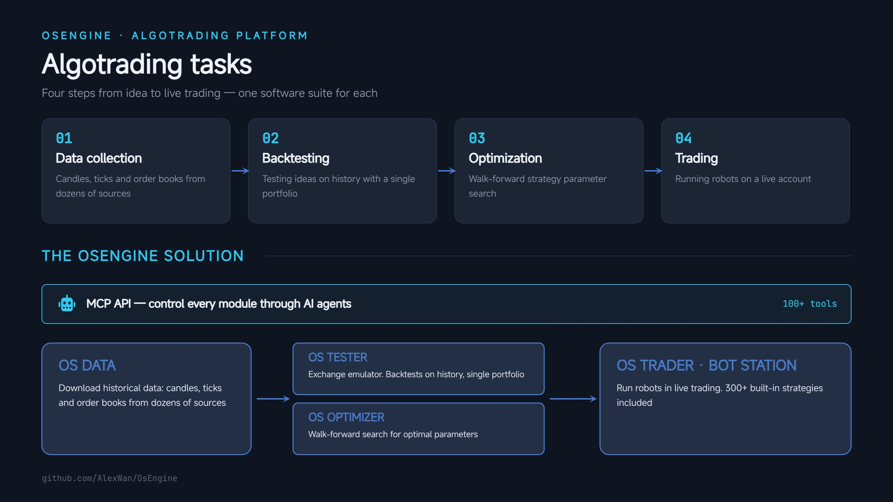
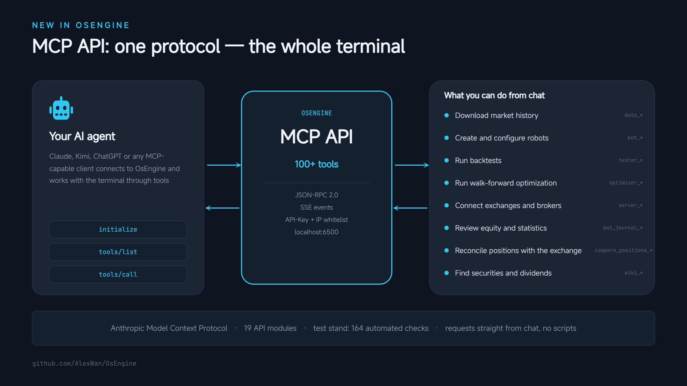

## Что такое OsEngine?

Это полный комплекс программ необходимых для автоматизации торговли на бирже.

[FAQ. Огромный гайд по работе с проектом из более чем 500 постов](https://o-s-a.net/os-engine-faq)

[Группа поддержки в Телеграмм](https://t.me/osengine_official_support)

[Группа поддержки в MAX](https://max.ru/join/Yar1c0k41XMwbnBXWutnmj4rWMk3RrhXIUqpGl8wOog)

[Софт внесён в перечень отечественного ПО Российской Федерации](https://reestr.digital.gov.ru/reestr/4075388/)

[Разрешено для создания выпускных квалификационных работ по направлениям Экономики и Программирования](https://o-s-a.net/os-engine-license-about)

## Что может проект

Слой создания роботов похожий на Wealth-Lab script и Ninja script. Он очень прост. Мы не изменяем его с каждым релизом и поддерживаем в нём обратную совместимость.

*MCP API* — встроенный сервер Anthropic Model Context Protocol. OsEngine становится терминалом под управлением ИИ: агент (Claude, Kimi, ChatGPT и любой другой MCP-клиент) прямо из чата скачивает историю, создаёт и настраивает роботов, запускает бэктесты и walk-forward оптимизацию, подключает биржи, смотрит эквити и сверяет позиции с биржей. Более 100 инструментов, события в реальном времени (SSE), авторизация по API-ключу и white-list IP. Справочник по API для ИИ-агентов: [CONTEXT_MCP.md](project/CONTEXT_MCP.md).

*OsData* — программа для загрузки исторических данных, с помощью которой Вы можете получать свечи, стаканы и тики из самых различных источников.

*OsTester* — эмулятор биржи. Программа для тестирования на истории множества стратегий одновременно, с единым портфелем. Поддерживает трансляцию нескольких таймфреймов и нескольких инструментов одновременно.

*OsOptimizer* — программа для подбора оптимальных параметров стратегии: walk-forward фазы, фильтры отсева между фазами, сохранение отчётов.

*OsTrader (Bot station)* — программа для запуска роботов в торговлю.

*Доступные подключения для MOEX*

<table align="center">
<tr><th>Лого</th><th>Имя</th><th>Поддержка</th></tr>
<tr><td align="center"></td><td align="center">T Bank</td><td align="center"></td></tr>
<tr><td align="center"></td><td align="center">ALOR OPEN API</td><td align="center"></td></tr>
<tr><td align="center"></td><td align="center">MOEX FixFast Spot</td><td align="center"></td></tr>
<tr><td align="center"></td><td align="center">MOEX FixFast Currency</td><td align="center"></td></tr>
<tr><td align="center"></td><td align="center">MOEX FixFast Forts</td><td align="center"></td></tr>
<tr><td align="center"></td><td align="center">Transaq</td><td align="center"></td></tr>
<tr><td align="center"></td><td align="center">Quik LUA</td><td align="center"></td></tr>
<tr><td align="center"></td><td align="center">Plaza 2</td><td align="center"></td></tr>
<tr><td align="center"></td><td align="center">Algopack Data</td><td align="center"></td></tr>
<tr><td align="center"></td><td align="center">Finam Data</td><td align="center"></td></tr>
<tr><td align="center"></td><td align="center">MFD Data</td><td align="center"></td></tr>
<tr><td align="center"></td><td align="center">MOEX ISS Data</td><td align="center"></td></tr>
<tr><td align="center"></td><td align="center">Asts Bridge</td><td align="center"></td></tr>
</table>

*Доступные международные подключения*

| ________ Лого ________                                                                                                                                                                   |_______ Имя _______  |  _______ Поддержка _______                                                                                         |
|:----------------------------------------------------------------------------------------------------------------------------------------------------------------------------------------:|:-------------------:|:------------------------------------------------------------------------------------------------------------------:|
|           | Interactive Brokers |     |
|                                                                                             | TraderNet           |     |
|                                                                                                   | Atp                 |     |
|                                                                                           | Kite Connect        |     |
|                                                                                                 | Yahoo Data          |     |
|                                                                                               | Polygon Io Data     |     |
|                                         | Ninja Trader        |        |

*Доступные подключения для бирж криптовалют*

| ________ Лого ________                                                                                                                                                                                                |_______ Имя _______  | _______ Поддержка _______                                                                                          |   Скидка пользователям OsEngine                                                                                                                                                                                                                                                                                                             |
|:---------------------------------------------------------------------------------------------------------------------------------------------------------------------------------------------------------------------:|:-------------------:|:------------------------------------------------------------------------------------------------------------------:|:-------------------------------------------------------------------------------------------------------------------------------------------------------------------------------------------------------------------------------------------------------------------------------------------------------------------------------------------:|
|                                                                | ByBit               |     |                                                                  |
|                                                | Binance             |     |                                                    |
|                                                | BitGet              |     |                                                   |
|                                                                                     | BloFin              |     |                                                                  |
|                                                                            | KuCoin              |     |                                                                  |
|                                                                     | OKX                 |     |                                                                     |
|                 | HTX (Huobi)         |     |      |
|                                                  | Gate IO             |     |                                                      |
|                                                                  | XT                  |                        |                                                    |
|                                                 | Askend              |                        |                                                    |
|                                                                  | Pionex              |                        |                                                        |
|                                                                            | WooX                |                        |                                                                             |
|                                                                                 | CoinEx              |                        |                                                                            |
|                                                                                | BitMart             |                        |                                                              |
|                                                                                | BingX               |        |                                                                     |
|                                                  | Exmo                |        |                                                                                                                                                                  |

*В комплекте с OsEngine идёт более 300 встроенных роботов*

1) трендовые роботы: пересечения скользящих средних, стратегии Билла Вильямса, трендовая стратегия Джесси Ливермора.

2) контртрендовые системы: Боллинджер, линии баланса, возврат к среднему.

3) сеточные стратегии и маркет-мейкинг: сетки ордеров, выставление плотностей в стакан.

4) арбитражные стратегии: парный трейдинг, индексный и валютный арбитраж, в том числе одноногие конструкции.

5) скринеры: одновременная торговля десятками инструментов из одного робота, включая фьючерсные связки.

6) высокочастотные роботы: работа со стаканом и тиковым потоком.

7) дивидендные стратегии: игра на отсечках и дивидендных гэпах.

8) роботы на свечных паттернах.

9) портфельные ребалансировщики и стратегии следования индексу.

ГАЙД: https://smart-lab.ru/company/os_engine/blog/1024149.php

Группа поддержки в MAX: https://max.ru/join/Yar1c0k41XMwbnBXWutnmj4rWMk3RrhXIUqpGl8wOog

Группа поддержки в телеграмм: https://t.me/osengine_official_support

Все права принадлежат ООО "Ван Технологии".

Разьяснения относительно лицензионного соглашения: https://o-s-a.net/os-engine-license-about

Загружая Os Engine, Вы соглашаетесь с тем что в случае возникновения критической ошибки, информация об этом будет выслана разработчику. Инструкция о том как отключить данный функционал: https://o-s-a.net/posts/crash-server.html

---

# Open Source Algo Trading Platform

[FAQ and instructions (More than 170 articles of study for free)](https://os-engine-eng.com/faq)

## What is OsEngine?

This is a full range of programs required to automate trading on the stock exchange.

## What the project can do

The layer for creating robots is similar to the Wealth-Lab script and Ninja Script. It's simple. We do not change it with every release and support backward compatibility.

*MCP API* — a built-in Anthropic Model Context Protocol server. OsEngine becomes an AI-driven terminal: an agent (Claude, Kimi, ChatGPT or any other MCP client) downloads market history, creates and configures robots, runs backtests and walk-forward optimization, connects exchanges, reviews equity and reconciles positions with the exchange — right from the chat. 100+ tools, real-time events (SSE), API-key authorization and IP whitelist. API reference for AI agents: [CONTEXT_MCP.md](project/CONTEXT_MCP.md).

*OsData* — program to download historical data. With the program you can get candles, market depths and trades from a variety of sources.

*OsTester* — exchange emulator. The program for testing on the history of many strategies at the same time, with a single portfolio. Supports translation of multiple timeframes and multiple instruments at the same time.

*OsOptimizer* — the program to select the optimal parameters for the strategy: walk-forward phases, filters between phases, report saving.

*OsTrader (Bot station)* — the program to run the robots in the trade.

*Available connections for MOEX*

| ________ logo ________                                                                                                                                  |_______ name _________ | _______ support _______                                                                                            |
|:-------------------------------------------------------------------------------------------------------------------------------------------------------:|:---------------------:|:------------------------------------------------------------------------------------------------------------------:|
|                                                          | T Bank                |     |
|    | ALOR OPEN API         |     |
|                                            | MOEX FixFast Spot     |     |
|                                            | MOEX FixFast Currency |     |
|                                            | MOEX FixFast Forts    |     |
|                                        | Transaq               |     |
|                                       | Quik LUA              |     |
|                                        | Plaza 2               |     |
|                                                             | Algopack Data         |     |
|                                                                | Finam Data            |     |
|                                                                  | MFD Data              |     |
|                                                             | MOEX ISS Data         |     |
|                                    | Asts Bridge           |        |

*Available international connections*

| ________ logo ________                                                                                                                                                                   |_______ name _______ |  _______ support _______                                                                                           |
|:----------------------------------------------------------------------------------------------------------------------------------------------------------------------------------------:|:-------------------:|:------------------------------------------------------------------------------------------------------------------:|
|           | Interactive Brokers |     |
|                                                                                             | TraderNet           |     |
|                                                                                                   | Atp                 |     |
|                                                                                           | Kite Connect        |     |
|                                                                                                 | Yahoo Data          |     |
|                                                                                               | Polygon Io Data     |     |
|                                         | Ninja Trader        |        |

*Available connections for cryptocurrency exchanges*

| ________ logo ________                                                                                                                                                                                                |_______ name _______ | _______ support _______                                                                                            |   discount for our users                                                                                                                                                                                                                                             |
|:---------------------------------------------------------------------------------------------------------------------------------------------------------------------------------------------------------------------:|:-------------------:|:------------------------------------------------------------------------------------------------------------------:|:------------------------------------------------------------------------------------------------------------------------------------------------------------------------------------------------------------------------------------------------------------------------:|
|                                                                | ByBit               |     |                                                                  |
|                                                | Binance             |     |                                                    |
|                                                | BitGet              |     |                                                   |
|                                                                                     | BloFin              |     |                                                                  |
|                                                                            | KuCoin              |     |                                                                  |
|                                                                     | OKX                 |     |                                                                     |
|                 | HTX (Huobi)         |     |      |
|                                                  | Gate IO             |     |                                                      |
|                                                                  | XT                  |                        |                                                    |
|                                                 | Askend              |                        |                                                    |
|                                                                  | Pionex              |                        |                                                        |
|                                                                            | WooX                |                        |                                                                             |
|                                                                                 | CoinEx              |                        |                                                                            |
|                                                                                | BitMart             |                        |                                                              |
|                                                                                | BingX               |        |                                                                     |
|                                                  | Exmo                |        |                                                                                                                                                                  |

*Included with OsEngine is more than 300 built-in robots*

1) Trend robots: moving average crossovers, Bill Williams strategies, the Jesse Livermore trend strategy.

2) Counter-trend systems: Bollinger Bands, balance lines, mean reversion.

3) Grid strategies and market making: order grids, order book density placement.

4) Arbitrage strategies: pair trading, index and currency arbitrage, including one-legged constructions.

5) Screeners: simultaneous trading of dozens of instruments from a single robot, including futures spreads.

6) High-frequency robots: order book and tick stream trading.

7) Dividend strategies: trading dividend cut-offs and gaps.

8) Candlestick pattern robots.

9) Portfolio rebalancers and index-following strategies.

By downloading Os Engine, you agree that if a critical error occurs, information about it will be sent to the developer. Instructions on how to disable this functionality: https://os-engine-eng.com/posts/crash-reception-server.html
